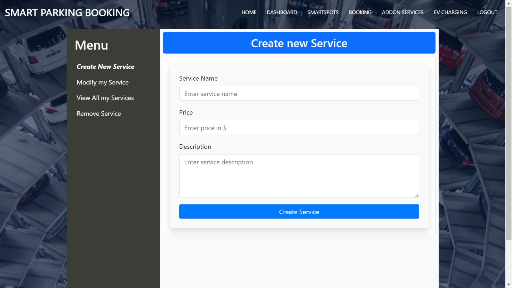

# Java Quick Park Assist

## Table of Contents
1. [Introduction](#introduction)
2. [Features](#features)
3. [Technologies Used](#technologies-used)
4. [System Architecture](#system-architecture)
5. [Installation Guide](#installation-guide)
6. [Usage](#usage)
7. [Modules](#modules)
8. [Database Design](#database-design)
9. [Integration Guide](#integration-guide)
9. [Future Enhancements](#future-enhancements)
10. [Conclusion](#conclusion)

---

## Introduction
The **Java Quick Park Assist** project is a smart parking system designed to provide users with an easy way to find, book, and manage parking spots with additional services like EV charging and car cleaning. The system allows users to search for available spots, make reservations, and manage their bookings through a seamless and efficient platform.

## Features
- **User Registration:** Allows vehicle owners and parking spot owners to register and manage their profiles.
- **Parking Spot Management:** Enables users to add, view, modify, and remove parking spots.
- **Parking Spot Booking:** Provides an intuitive interface for booking and managing parking spots.
- **Addon Services:** Users can book additional services like cleaning and polishing.
- **EV Charge Reservation:** Facilitates electric vehicle charging slot reservations.

**KEY FEATURES**
   -  OTP Verification: Ensures secure registration and account activation by sending a one-time password to the user's registered email or phone number.

   -  Account Activation: Users must verify their email or phone number to activate their accounts and start using the services.

   -  Forgot Password: Allows users to securely reset their passwords via email or SMS authentication.

   -  Secure Login & Authentication: Implements industry-standard authentication and authorization mechanisms.

## Technologies Used
### Backend:
-  Java : Version 17 
-  MySQL: Version 8.0.32
-  Spring Boot Data JPA: Version 3.4.2
-  Spring Boot REST Services: Version 3.4.2
-  SonarQube: Version 9.9.8
-  Splunk: Version 9.4
-  Swagger: Version
### Frontend:
-  Thymeleaf: Version 3.1.3.RELEASE 
-  HTML, CSS, JavaScript: 

## System Architecture
```sh
+-------------------------------+
|         Frontend UI           |
| (HTML, CSS, JavaScript, Thymeleaf) |
+-------------------------------+
              |
              V
+-------------------------------+
|         Backend (API Layer)   |
|  (Spring Boot, REST APIs)     |
+-------------------------------+
              |
              V
+-------------------------------+
|         Database Layer        |
|       (MySQL, Spring JPA)     |
+-------------------------------+
```


## Installation Guide
1. **Clone the repository:**
   ```sh
   git clone https://github.com/your-repo/quick-park-assist.git
   cd quick-park-assist
   ```
2. **Set up the database:**
   - Install MySQL and create a database named `quick_park_assist`.
   - Configure database properties in `application.properties`.
3. **Install dependencies:**
   ```sh
   mvn clean install
   ```
4. **Run the application:**
   ```sh
   mvn spring-boot:run
   ```
5. **Access the application:**
   - Open `http://localhost:8080` in a web browser.

## Usage
### User Registration

- Register as a vehicle owner or parking spot owner.
- View and update user profile.
- Deactivate or delete account if necessary.

### Parking Spot Management

- Add new parking spots with details like location, pricing, and availability.
- Search and view available spots.
- Modify or remove parking spots.

### Booking Process

- Book available spots by selecting a location and time.
- View, modify, or cancel bookings.
- Identify booked spots using a mobile number.

### Addon Services

- Book additional services like cleaning and polishing.
- Modify or remove addon services.
    ### For Vehicle Owner 


### EV Charging Reservation

- Reserve EV charging slots.
- Modify or delete reservations.

## Database Design

- **Tables:** Users, ParkingSpots, Bookings, AddonServices, EVReservations.
- **Relationships:** One-to-many mappings between users and bookings, parking spots, and services.

## Integration Guide

**Set up the database:**

Install MySQL and create a database named quick_park_assist.

Configure database properties in application.properties.
```sh
  spring.datasource.url=jdbc:mysql://localhost:3306/quick-park-assist?createDatabaseIfNotExist=true
  spring.datasource.username=root
  spring.datasource.password= yourDbPassword
```

**Access the application:**

-  Open http://localhost:8080 in a web browser.

Integration Guide

**SonarQube Integration**

Install SonarQube (Download from SonarQube).

Configure SonarQube in pom.xml:

<plugin>
    <groupId>org.sonarsource.scanner.maven</groupId>
    <artifactId>sonar-maven-plugin</artifactId>
    <version>3.9.1.2184</version>
</plugin>

Start SonarQube Server:
   ```sh
      cd /path-to-sonarqube/bin/
      ./sonar.sh start
   ```


**Run SonarQube Analysis:**
   ```sh
      mvn sonar:sonar -Dsonar.host.url=http://localhost:9000
   ```

**Access SonarQube Dashboard:**
Open http://localhost:9000 and check your project’s analysis.


**Swagger-UI Integration**

-  Add Swagger dependencies to pom.xml:
```sh
<dependency>
    <groupId>org.springdoc</groupId>
    <artifactId>springdoc-openapi-starter-webmvc-ui</artifactId>
    <version>2.0.2</version>
</dependency>
```
Enable Swagger in application.properties:
```sh
   springdoc.api-docs.enabled=true  
   springdoc.swagger-ui.path=/swagger-ui.html
```
Run the application and access Swagger UI:

   -  Open http://localhost:8080/swagger-ui/index.html.
   

**SplunkEC Integration**

-  Download and Install Splunk Enterprise (Edition) from Splunk.

-  Install Splunk SDK in your system

-  Open browser and navigate to https://localhost:8000 

-  Navigate to Settings → Data Inputs → HTTP Event Collector (HEC).

-  Add Splunk HTTP Event Collector (HEC) Token:

-  Enable in Global Settings 

-  Enable HEC and create a token.

-  Configure Splunk in Spring Boot application.properties:
```sh
splunk.hec.url=http://localhost:8088
splunk.hec.token=your-hec-token
```
-  Add Logback appender to log4j2.xml:

-  Add dependencies in pom.xml
```sh
   <dependency>
		<groupId>org.springframework.boot</groupId>
		<artifactId>spring-boot-starter-data-jpa</artifactId>
			<exclusions>
				<exclusion>
					<groupId>org.springframework.boot</groupId>
					<artifactId>spring-boot-starter-logging</artifactId>
				</exclusion>
				<exclusion>
					<groupId>ch.qos.logback</groupId>
					<artifactId>logback-classic</artifactId>
				</exclusion>
			</exclusions>
	</dependency>

   <dependency>
			<groupId>org.springframework.boot</groupId>
			<artifactId>spring-boot-starter-web</artifactId>
		<exclusions>
				<exclusion>
					<groupId>org.springframework.boot</groupId>
					<artifactId>spring-boot-starter-logging</artifactId>
				</exclusion>
				<exclusion>
					<groupId>ch.qos.logback</groupId>
					<artifactId>logback-classic</artifactId>
				</exclusion>
		</exclusions>
	</dependency>
   ```

   -  These above dependencies should be excluded for the log4js to be selected and used in the project.

   -  And these dependencies and a specific repository should be added.
 ```sh
   <repositories>
		<repository>
			<id>splunk-artifactory</id>
			<name>Splunk Releases</name>
			<url>https://splunk.jfrog.io/splunk/ext-releases-local</url>
		</repository>
	</repositories>
   <dependency>
			<groupId>org.springframework.boot</groupId>
			<artifactId>spring-boot-starter-log4j2</artifactId>
	</dependency>
	
   <dependency>
			<groupId>com.splunk.logging</groupId>
			<artifactId>splunk-library-javalogging</artifactId>
			<version>1.8.0</version>
			<scope>runtime</scope>
	</dependency>
```
-  Add this Configuration in the log4j2.xml in resources directory
```sh
<configuration>
   <Appenders>
      <!-- Splunk HTTP Event Collector Appender -->
        <SplunkHttp
                name="yourHECName"
                url="http://localhost:8088"
                token="your-hec-token"
                host="localhost"
                index="your-index"
                type="raw"
                source="your-source"
                sourcetype="log4j"
                messageFormat="text"
                disableCertificateValidation="true">
            <PatternLayout pattern="%m" />
        </SplunkHttp>
   <Appenders>
    <root level="info">
        <appender-ref ref="yourHECName" />
    </root>
</configuration>
```

-  Verify logs in Splunk:
-  Open Splunk UI and search logs with index="yourIndexName".


**Graphana Integration**
-  Download and Install graphana from the website https://grafana.com/grafana/download
- After installation Open Browser and navigate to http://localhost:3000


*Prometheus Integration*
-  Download Prometheus from the website https://prometheus.io/download/
- Unzip and Configure the prometheus.yml File
```sh
  - job_name: "spring-actuator"
    metrics_path: "/actuator/prometheus"
    scrape_interval: 5s
    static_configs:
      - targets: ["localhost:8081"]
```
-  Now After teh configuring the File now Run the Prometheus Server(`prometheus.exe`).
- Now for prometheus we need to add some dependencies like:
```sh
        <dependency>
			<groupId>io.micrometer</groupId>
			<artifactId>micrometer-registry-prometheus</artifactId>
		</dependency>
		
		<dependency>
			<groupId>org.springframework.boot</groupId>
			<artifactId>spring-boot-starter-actuator</artifactId>
				<exclusions>
					<exclusion>
						<groupId>ch.qos.logback</groupId>
						<artifactId>logback-classic</artifactId>
					</exclusion>
				</exclusions>
		</dependency>
```
-   After adding the dependencies.Open browser and navigate to http://localhost:9090 where prometheus is Running

***Prometheus and Graphana Integration***
-   After running the Open graphana Dashboard and import a readymade JSON file for springBoot and use prometheus as a data-source.
- After that we can see a springBoot Dashboard which looks like this:


## Future Enhancements
- Implement AI-based dynamic pricing for parking spots.
- Develop a mobile application for better accessibility.
- Integrate real-time parking availability using IoT sensors.

## Conclusion
The Java Quick Park Assist system aims to provide a hassle-free parking experience with value-added services. By leveraging modern web technologies, this platform offers efficiency and convenience for urban commuters and EV owners.

---
For contributions or suggestions, feel free to raise an issue or pull request on GitHub!

